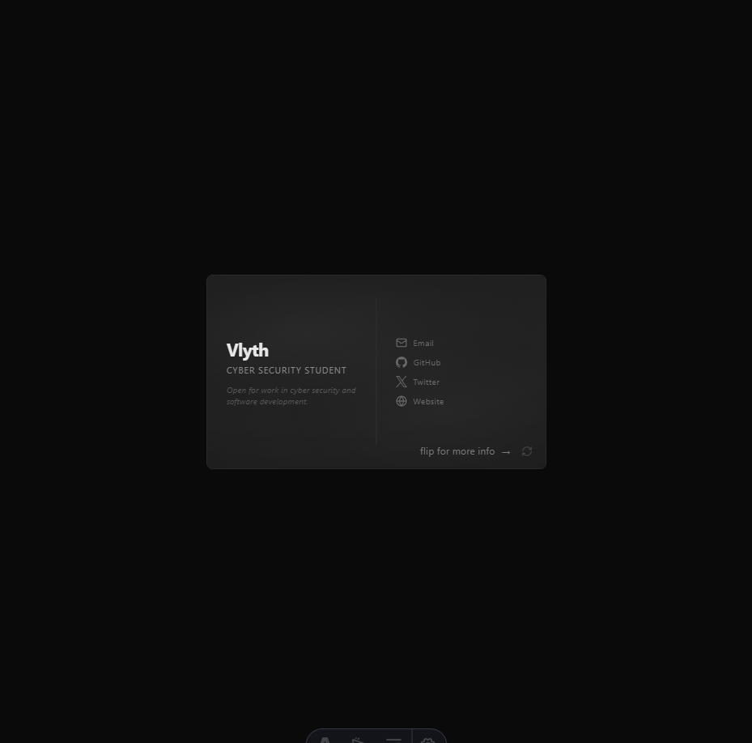
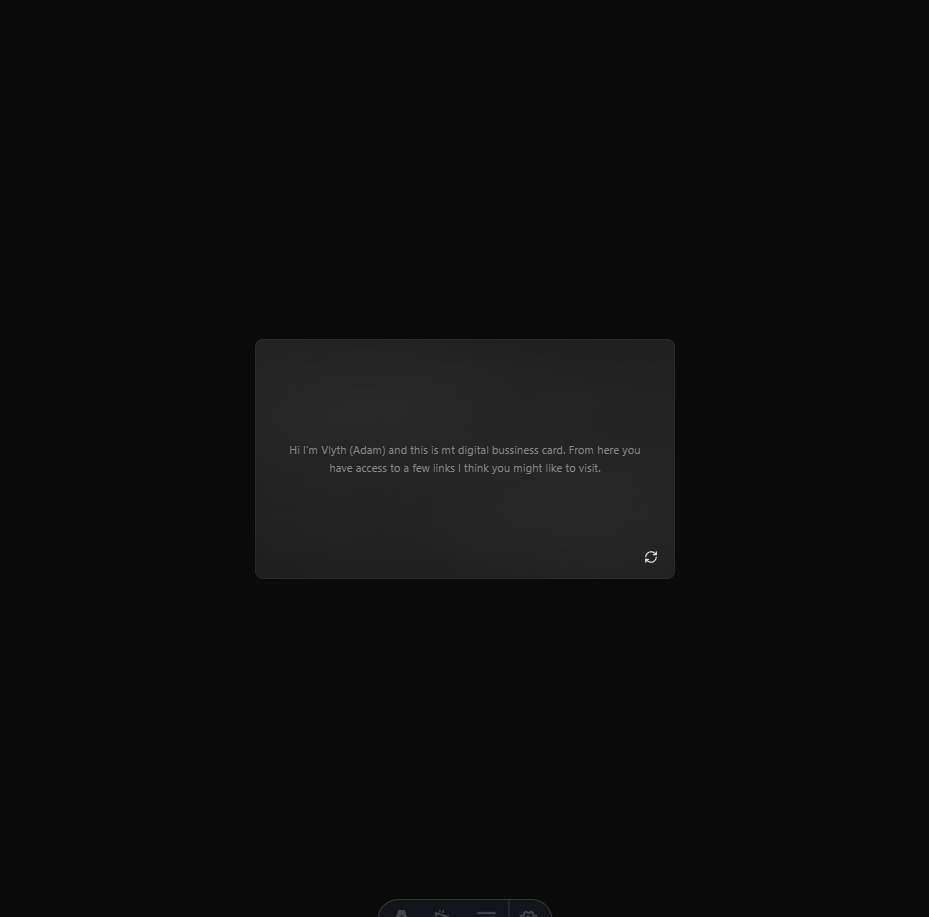

# Digital Business Card

An interactive 3D digital business card built with [Astro](https://astro.build). Features tilt physics, light reflections, mouse-tracking effects, and a flip animation — all in a single page.




---

## Quick start

```sh
git clone https://github.com/vlyth-exe/digital-business-card.git
cd digital-business-card
npm install
npm run dev
```

The dev server starts at `http://localhost:4321`.

## Build for production

```sh
npm run build    # outputs to ./dist/
npm run preview  # preview the build locally
```

The output is fully static — deploy the `dist/` folder to any host (Vercel, Netlify, Cloudflare Pages, GitHub Pages, etc.).

---

## Customising your card

All card content lives in a single file:

### `src/data/card.json`

```json
{
  "name": "Your Name",
  "role": "Your Title",
  "quip": "A short one-liner about you.",
  "links": [
    {
      "label": "Email",
      "url": "mailto:you@example.com",
      "icon": "lucide:mail"
    },
    {
      "label": "GitHub",
      "url": "https://github.com/your-handle",
      "icon": "simple-icons:github"
    }
  ],
  "back": "A longer paragraph for the back of the card — your bio, elevator pitch, or anything you want people to know."
}
```

| Field | Description |
|-------|-------------|
| `name` | Displayed as the main heading on the front |
| `role` | Subtitle beneath your name |
| `quip` | A short tagline or availability notice |
| `links` | Array of links shown on the right side of the card |
| `links[].label` | Visible text for the link |
| `links[].url` | Full URL (use `mailto:` for email) |
| `links[].icon` | Icon name — see [Icons](#icons) below |
| `back` | Paragraph text shown on the back of the card |

---

## Icons

Icons are rendered by `src/components/Icon.astro` using [Iconify](https://iconify.design/) icon sets:

- **[Lucide](https://lucide.dev/icons/)** — general UI icons. Use the prefix `lucide:`, e.g. `lucide:mail`, `lucide:globe`, `lucide:phone`
- **[Simple Icons](https://simpleicons.org/)** — brand logos (~3,000 brands). Use the prefix `simple-icons:`, e.g. `simple-icons:github`, `simple-icons:x`, `simple-icons:linkedin`

### Adding a new link

Add an entry to the `links` array in `card.json`:

```json
{
  "label": "LinkedIn",
  "url": "https://linkedin.com/in/your-handle",
  "icon": "simple-icons:linkedin"
}
```

### Fallback behaviour

If an icon name isn't found in either collection, the component falls back to loading a [Google favicon](https://www.google.com/s2/favicons) for the link's domain, displayed in greyscale. This means even obscure services will get a recognisable icon automatically.

---

## Features

### Entrance animation

The card swipes up from below the viewport, starting sideways at 90° rotation, with an overshoot easing (`cubic-bezier(0.16, 1.3, 0.3, 1)`) and settles into place in 0.8 seconds.

### 3D tilt

**Drag anywhere on the background** to tilt the card in 3D:

- Full responsiveness up to 25°, then a soft rubber-band extension (15% of additional drag)
- Spring physics on release (stiffness: 0.12, damping: 0.75) so the card smoothly returns to rest
- Clicks on card content (links, buttons) are ignored for drag detection

### Light reflections

Two elliptical radial gradients on both card faces, driven by the tilt angle:

- **Light 1** (upper-left) shifts with stronger sensitivity (1.2×)
- **Light 2** (lower-right) shifts in the **opposite direction** with softer sensitivity (0.8×)
- Very subtle — max 5% and 4% opacity
- Lights animate smoothly during flip transitions

### Mouse light

An independent light source that follows the cursor when hovering over the card:

- Light 1 follows the cursor directly (1.5% opacity)
- Light 2 mirrors to the opposite side (1.2% opacity)
- Smooth lerp animation (15% per frame)
- Fades in/out on hover enter/leave
- Hidden during flip transitions to prevent visual artifacts

### Card flip

Click the flip button (bottom-right corner) to reveal the back:

- Two-element animation — no `backface-visibility` trick
- **Flip out** (0–300ms): visible face rotates 0° → 90° with `ease-in`
- **Swap at midpoint**: faces toggle via `display`
- **Flip in** (300–600ms): new face rotates −90° → 0° with `ease-out`

### Flip hint

If the user hasn't flipped the card after 10 seconds, a subtle "flip for more info →" hint fades in next to the flip button. It dismisses immediately on the first flip.

---

## Tech stack

| Package | Purpose |
|---------|---------|
| [Astro](https://astro.build) | Static site framework |
| [astro-icon](https://github.com/niconiahi/astro-icon) | Icon integration |
| [@iconify-json/lucide](https://iconify.design/) | General UI icons |
| [@iconify-json/simple-icons](https://simpleicons.org/) | Brand icons |
| [@iconify/utils](https://github.com/iconify/iconify) | Icon data utilities |

All interactions (tilt, lights, flip, hint) are vanilla JavaScript — no framework runtime shipped to the browser.

---

## File structure

```
src/
├── components/
│   └── Icon.astro          # Icon component with Google favicon fallback
├── data/
│   └── card.json           # All card content (name, role, links, bio)
├── pages/
│   └── index.astro         # Main page — card, animations, tilt, lights, flip
astro.config.mjs            # Astro config with astro-icon integration
```

---

## Commands

| Command | Action |
|:--------|:-------|
| `npm install` | Install dependencies |
| `npm run dev` | Start dev server at `localhost:4321` |
| `npm run build` | Build production site to `./dist/` |
| `npm run preview` | Preview the production build locally |

---

## License

This project is open source — use it as a template for your own digital business card.